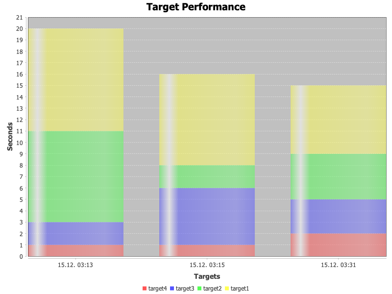

# AntStatistics #
## Description ##
This Ant logger logs execution times for all build targets and displays them at the end of the build. Moreover, execution times of past builds are collected and graphed in a chart.

## Configuration ##
AntStatistics can be configured via Ant properties

| **Property** | **Description** | **Default** |
|:-------------|:----------------|:------------|
| `antstatistics.history.expire` | Number of builds to keep in history | 5           |
| `antstatistics.chart.height` | Chart image height | 800         |
| `antstatistics.chart.width` | Chart image width | 600         |
| `antstatistics.target.threshold` | Threshold for the chart, targets with execution times lower than this will not be included | 200         |
| `antstatistics.directory` | Directory for AntStatistics to keep its data | _antstatistics_ |

## Usage ##
**Variant 1** (assuming AntStatistics and its dependencies are available in the Ant classpath)
```
ant -logger de.pellepelster.ant.statistics.AntStatisticsLogger -f build.xml target
```

**Variant 2** (assuming AntStatistics and its dependencies lie under _~/ant/antstatistics_
```
ant -lib ~/ant/antstatistics -logger de.pellepelster.ant.statistics.AntStatisticsLogger -f build.xml target
```

## Example Chart ##


## Example Build Output ##
```
     [exec] Buildfile: /home/pelle/workspace/de.pellepelster.ant.statistics/test/build1.xml
     [exec]      [echo] Random:3
     [exec]      [echo] Random:3
     [exec]      [echo] Random:3
     [exec]      [echo] Random:1
     [exec]      [echo] Random:3
     [exec] BUILD SUCCESSFUL
     [exec] Total time: 13 seconds
     [exec] +------------------------------------+
     [exec] |               build1               |
     [exec] +------------------------------------+
     [exec] | Target  | Duration(s) | Duration % |
     [exec] +------------------------------------+
     [exec] | target1 |     10      |   47.00%   |
     [exec] | target2 |      6      |   28.00%   |
     [exec] | target3 |      4      |   19.00%   |
     [exec] | target4 |      1      |   4.00%    |
     [exec] +------------------------------------+
     [exec] |         total time (s): 13         |
     [exec] +------------------------------------+
BUILD SUCCESSFUL
Total time: 17 seconds
```